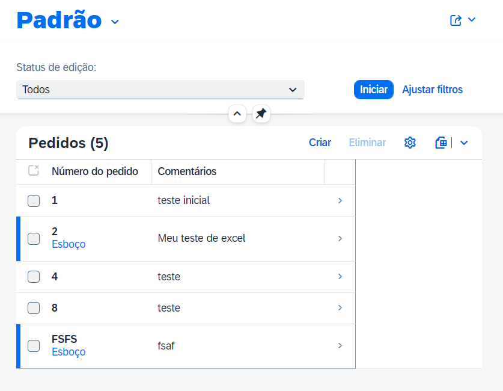
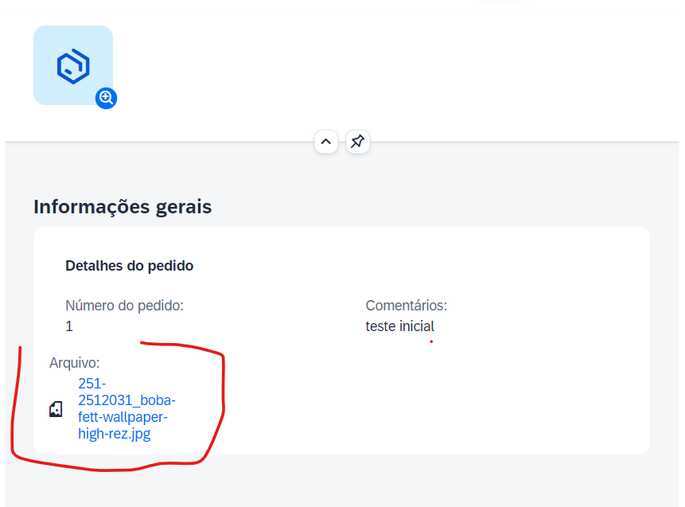
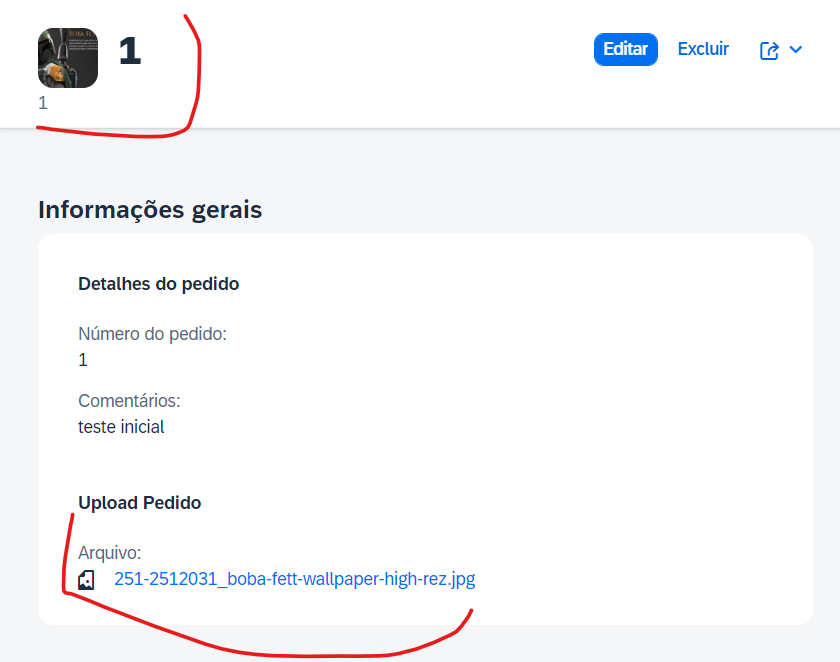

# Descrição
Aplicativo com upload de arquivo(único) 
Obs: para o funcionamento é necessário seguir o padrão rascunho/esbouço(draft) do RAP
# Telas do app

1. Tela inicial

    

2. Tela de detalhes

    Odata v2

    
    
    Odata v4
    
    
